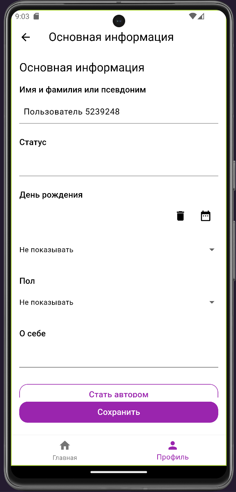

# Digital bookshelf

### [Сервер](https://github.com/brash-ram/digital-bookshelf)

## Используемые технологии

- Dart
- Flutter
- Bloc
- Slang
- Dart mappable
- Auto route

## Реализованная функциональность

### Окно профиля при неавторизированном доступе

`Для дооступа к приложение авторазация не обязательна`

### Окно авторизации

На этом экране можно как войти так и зарегистрироваться,
реализована валидация, в том числе ответов от сервера.

### Окно моего профиля

На экране расположено основное меню действий пользователя.
В верхней части экрана случайно-генерируемое изображение котика и имя пользователя.

### Окно изменения основной информации пользователя

На данном экране можно изменить основную информацию пользователя.
Внизу формы имеется кнопка для переключения пользователя в статус автора.

`По умолчанию пользователь не является автором.
Для него недоступен функционал по добавлению книг и всему что с этим связано.`

### Окно изменения контактов

На данном экране можно изменить ссылки на страницу пользователя в
разных внешних ресурсах.

